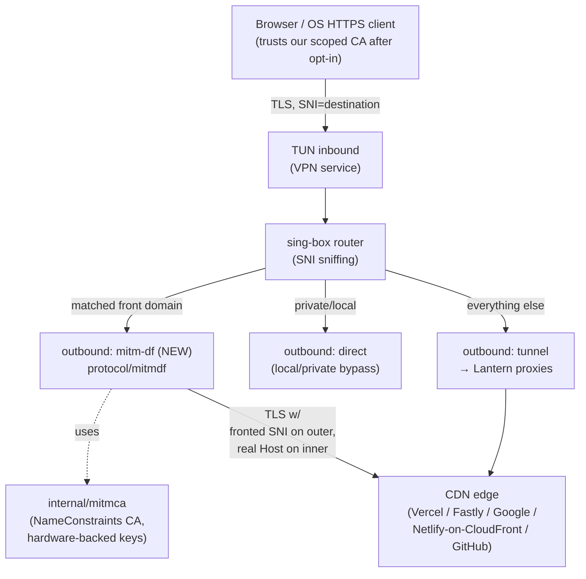

# MITM-DomainFronting outbound — architecture

**Status**: design + first implementation slice (CA generator). Tracking issue: [getlantern/engineering#3482](https://github.com/getlantern/engineering/issues/3482).

This document describes how lantern-box implements **client-only domain fronting** via local TLS MITM with a `NameConstraints`-scoped CA. The technique is a port of the patterniha/MITM-DomainFronting concept (now upstream in XTLS/Xray-core via PR #4348) into the sing-box outbound model, with material security hardening (`NameConstraints`, hardware-backed keys, 127.0.0.1-only binding, denylist, audit log).

The "why" — including why the on-the-wire SNI cannot simply be byte-swapped (TLS transcript HMAC binding), and the threat-model analysis that motivates the hardening — lives on engineering#3482. **Read that first** if you haven't yet. This doc is the "how."

## Scope

In: Android, iOS, macOS, Windows, Linux (where lantern-box ships).
Out: web extension / browser-only contexts; iOS without VPN entitlement; rooted vs unrooted parity is handled by the platform's own trust-store rules, not by us.

The feature is **opt-in**, off by default. Users who opt in install a per-device, name-constrained CA into their trust store. Users who don't opt in are unaffected.

## Component map



## Package layout

```
lantern-box/
  internal/
    mitmca/            ← NameConstraints CA generator + key storage
      ca.go            ← CA struct, GenerateCA, SignLeaf, Serialize
      ca_test.go       ← table-driven tests; cert verification against scoped SAN list
      keystore.go      ← per-platform key storage abstraction (file-based default;
                         hardware-backed via build tags: keystore_macos.go,
                         keystore_android.go, keystore_windows.go)
      keystore_test.go
  protocol/
    mitmdf/            ← The MITM-DF outbound itself (sibling to algeneva/,
                         lanturn/, samizdat/, unbounded/, water/)
      outbound.go      ← sing-box outbound type; implements N.Dialer; owns the
                         per-dial serve goroutine that bridges user TLS ↔ egress TLS
      fronts.go        ← Fronts table parsing, suffix-aware matcher, deny-list
      audit.go         ← JSONL audit log of every decision (allow/deny/no-match/error)
      utls_preset.go   ← uTLS HelloCustom + ApplyPreset so the user's negotiated
                         ALPN survives the egress handshake (named presets bake
                         [h2, http/1.1] into the ClientHello extension otherwise)
      pinner.go        ← SPKI pinning for the egress (proxy→CDN) TLS [follow-up]
      *_test.go
  option/
    mitmdf.go          ← Config struct for "type": "mitm-df" outbounds
  test/e2e/
    mitmdf_test.go     ← in-process fronting-server e2e: captures egress SNI +
                         ALPN, asserts allow + deny paths and audit records
  docs/
    mitm-df/
      architecture.md  ← this file
      operations.md    ← runbook: weekly fronts validation, kill-switch path [follow-up]
      security.md      ← residual-risk summary (link to engineering#3482) [follow-up]
```

`internal/mitmca/` stays under `internal/` because it's a private helper consumed only by `protocol/mitmdf/`; the outbound itself moves under `protocol/` to match the existing sibling transports.

## Public Go types

The `mitmca` package exposes a small API:

```go
package mitmca

// CA is a name-constrained root CA used to sign leaf certificates for the
// MITM-DF outbound's inbound TLS server.
type CA struct {
    cert       *x509.Certificate
    privateKey crypto.Signer  // ECDSA P-256; may be hardware-backed
    permittedDomains []string // mirrors x509.NameConstraints.PermittedDNSDomains
}

// GenerateCA creates a fresh CA scoped to the given permitted DNS subtrees
// (RFC 5280 §4.2.1.10 PermittedSubtrees). The private key is generated via
// the supplied KeyStore — pass HardwareKeyStore on platforms that support it,
// FileKeyStore otherwise. Validity defaults to 30 days; rotation is the
// caller's responsibility.
func GenerateCA(permittedDNS []string, ks KeyStore, validity time.Duration) (*CA, error)

// LoadCA reloads a previously-saved CA from its serialized cert + the KeyStore.
func LoadCA(certPEM []byte, ks KeyStore) (*CA, error)

// CertPEM returns the CA cert in PEM form for trust-store installation.
// The private key is intentionally not exposed; only the CA itself signs.
func (c *CA) CertPEM() []byte

// SignLeaf mints a leaf cert for the given SNI. The leaf SAN list is exactly
// [sni]; the cert is short-lived (24h). Returns an error if the SNI does not
// fall within the CA's permitted subtrees.
func (c *CA) SignLeaf(sni string) (*tls.Certificate, error)

// KeyStore abstracts private-key storage. Implementations:
//   - FileKeyStore: PKCS#8-encoded ECDSA on disk, mode 0600.
//   - HardwareKeyStore: per-platform Secure Enclave / Android Keystore / TPM.
//     Key material is never extractable; KeyStore.PrivateKey returns a signer
//     that calls into the hardware for each sign operation.
type KeyStore interface {
    GenerateKey() (crypto.Signer, error)
    StoreKey(crypto.Signer) error
    LoadKey() (crypto.Signer, error)
    Erase() error
}
```

And the `mitmdf` package exposes:

```go
package mitmdf

// Outbound is registered as sing-box outbound type "mitm-df". It owns a
// local TLS server on 127.0.0.1:<configured port> plus per-front dial logic.
type Outbound struct {
    ca      *mitmca.CA
    fronts  []FrontEntry
    deny    DenyList
    audit   *AuditLog
    pinner  *Pinner
    // ... sing-box outbound machinery
}

// FrontEntry maps a set of inbound destination domains to a fronted SNI used
// when dialing the CDN, plus the allowed SAN list the CDN's cert must satisfy.
type FrontEntry struct {
    MatchDomains []string // sing-box domain matchers (geosite:, domain:, suffix:, ...)
    FrontedSNI   string
    VerifySAN    []string
    // optional: fallback list if FrontedSNI is itself blocked
    FrontedSNIFallbacks []string
}
```

## Config schema

A working sing-box `outbounds[]` entry of type `mitm-df`:

```jsonc
{
  "type": "mitm-df",
  "tag":  "mitm-df",
  "listen_addr": "127.0.0.1:11777",
  "ca": {
    "cert_path": "$DATA_DIR/mitm-ca.crt",
    "key_storage": "auto"   // "auto" = hardware if available else file
  },
  "fronts": [
    {
      "match_domains": ["geosite:google", "domain:googleapis.com"],
      "fronted_sni":   "www.google.com",
      "verify_san":    ["www.google.com", "dns.google", "www.googlevideo.com"]
    },
    {
      "match_domains": ["geosite:vercel", "domain:nextjs.org"],
      "fronted_sni":   "nextjs.org",
      "verify_san":    ["nextjs.org", "vercel.com", "vercel.app", "react.dev"]
    },
    {
      "match_domains": ["geosite:fastly", "geosite:reddit", "domain:github.com",
                        "domain:raw.githubusercontent.com"],
      "fronted_sni":   "www.python.org",
      "verify_san":    ["www.python.org", "github.com", "reddit.com",
                        "githubusercontent.com"]
    },
    {
      "match_domains": ["geosite:netlify"],
      "fronted_sni":   "kubernetes.io",
      "verify_san":    ["kubernetes.io", "letsencrypt.org", "aws.amazon.com"]
    }
  ],
  "deny_domains": ["geosite:banks-ir", "geosite:gov-ir", "geosite:healthcare"],
  "audit_log_path": "$DATA_DIR/mitm-df-audit.log",
  "client_hello_fingerprint": "chrome"
}
```

Route rules that send matching traffic to it:

```jsonc
"route": {
  "rules": [
    { "domain": ["geosite:google", "geosite:vercel", "geosite:fastly",
                 "geosite:reddit", "geosite:netlify", "geosite:github"],
      "outbound": "mitm-df" },
    { "ip_is_private": true, "outbound": "direct" },
    { "outbound": "tunnel" }
  ]
}
```

## Request flow

1. Browser opens TCP to `vercel.com:443` and emits a ClientHello with `SNI=vercel.com`.
2. TUN inbound captures the packet; sing-box parses the ClientHello and extracts the SNI without breaking TLS.
3. Router rule `domain:geosite:vercel` → `outbound: mitm-df`.
4. The `mitm-df` outbound's local TLS server accepts the TCP stream (still containing the original ClientHello bytes).
5. `tls.Config.GetCertificate(hello)` callback:
   - Reads `hello.ServerName = "vercel.com"`.
   - Checks against the `deny` list — block if matched.
   - Verifies `"vercel.com"` falls under one of the CA's `permittedDomains` (defense in depth — CA itself enforces this cryptographically too).
   - Calls `ca.SignLeaf("vercel.com")` to mint a 24-hour leaf cert.
   - Logs `{ts, sni, fronted_sni, decision}` to the audit log.
   - Returns the leaf as the cert for this handshake.
6. Browser's TLS handshake completes against our server. Browser sends HTTP request inside.
7. `mitmdf.session` reads the inner HTTP request, extracts the Host header.
8. Front-selection: look up `vercel.com` in `fronts`; pick `fronted_sni: nextjs.org` and `verify_san: [...]`.
9. Dial the CDN: TCP connect to the resolved IP of vercel.com, then a fresh outbound TLS handshake with `ServerName: "nextjs.org"` and a uTLS Chrome fingerprint (`utls` library).
10. SPKI pin check on the CDN's cert: must chain to a known CDN intermediate and the leaf's SAN list must intersect `verify_san`.
11. Send the inner HTTP request over the outbound TLS connection, **with `Host: vercel.com` preserved**.
12. Pipe response back to browser over the inbound (CA-signed) TLS connection.

## Security properties (reflected from engineering#3482)

| Property | How it's enforced |
|---|---|
| CA can only sign certs for the supported CDN families | RFC 5280 `NameConstraints` on the root cert; `tls.Config.GetCertificate` also rejects outside `permittedDomains` before minting |
| Private key not exfiltrable | `HardwareKeyStore` where supported (Secure Enclave, Android StrongBox, TPM); `FileKeyStore` is the fallback with mode 0600 + DPAPI/keyring wrap |
| Compromise blast radius = one device | Per-device key generation; no bundled CA in the binary |
| MITM port not reachable from network | Listener bound `127.0.0.1` only |
| Sensitive domains never minted | `deny_domains` enforced in `GetCertificate` callback regardless of route rules |
| Stale CA after uninstall | Uninstall flow surfaces trust-store removal; on supported platforms, automated where possible |
| CA expiry forces rotation | 30-day validity; expiry triggers regeneration + re-install prompt |
| Old platforms without `NameConstraints` enforcement | Outbound refuses to start on Android < 9 / Windows < 10; `deny_domains` is the only defense; this is opted out of by default |

## Operational dependencies

- **Config-server channel** for `fronts` table updates — same channel that pushes tracks/outbounds today (`getlantern/lantern-cloud` `/v1/config-new` endpoint). Updates apply without a binary release.
- **Weekly CI validation job** in `getlantern/lantern-cloud` that connects to each `(fronted_sni, real_destination)` pair, checks SAN intersection, and opens a GH issue if a pairing breaks.
- **Kill switch**: a flag in the config response (`mitm_df_enabled: false`) disables the outbound regardless of local config; takes effect on the next config fetch (~5 min).

See `docs/mitm-df/operations.md` for the runbook (not yet written).

## Implementation order

Roughly the order we'll ship the foundation in:

1. **`internal/mitmca`** — CA generator, name constraints, file-based keystore, tests. *Starting point of the first PR; lives behind no feature flag, ships even before the outbound is wired.*
2. **`internal/mitmca/keystore_*.go`** — per-platform hardware-backed key storage.
3. **`protocol/mitmdf/fronts.go`** — fronts-table parsing and matcher; reusable against sing-box's domain matchers.
4. **`protocol/mitmdf/outbound.go`** — sing-box outbound registration; owns the per-dial `serve` goroutine (bridges user TLS ↔ egress uTLS via `net.Pipe()` so there is no listening port).
5. **`protocol/mitmdf/utls_preset.go`** + **`protocol/mitmdf/audit.go`** — fingerprint preset (with ALPN inheritance via `HelloCustom`+`ApplyPreset`) and JSONL audit writer.
6. **`option/mitmdf.go`** — config schema.
7. **Cross-repo wiring**: Flutter UI, config-server push channel, weekly validation CI.

Each step has its own PR. This doc gets updated as the design evolves.
